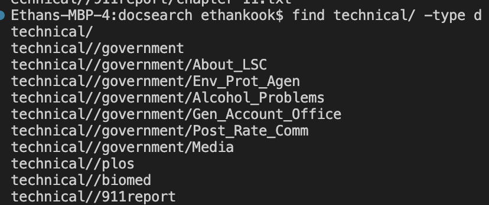
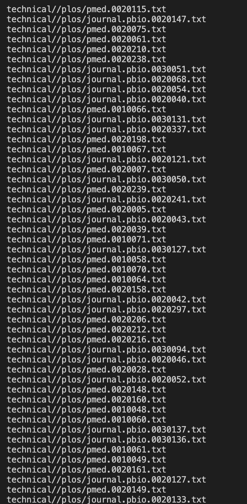
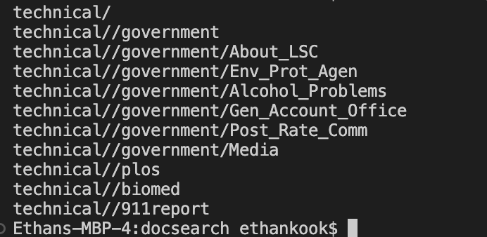
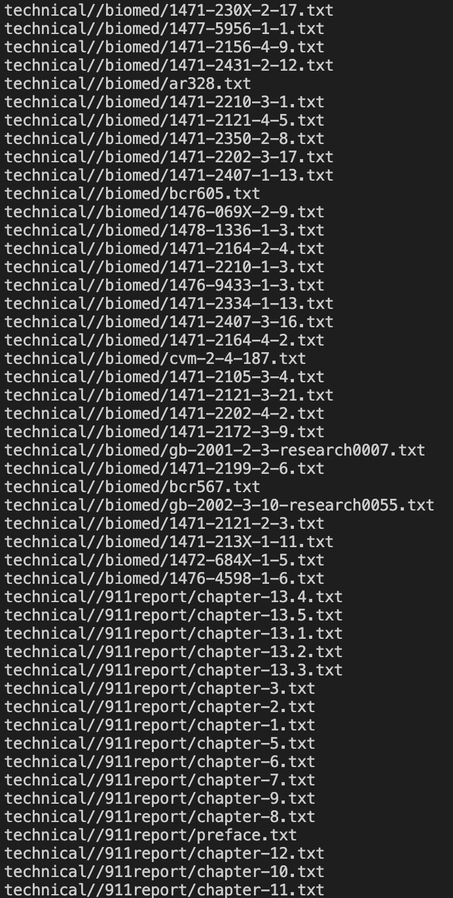
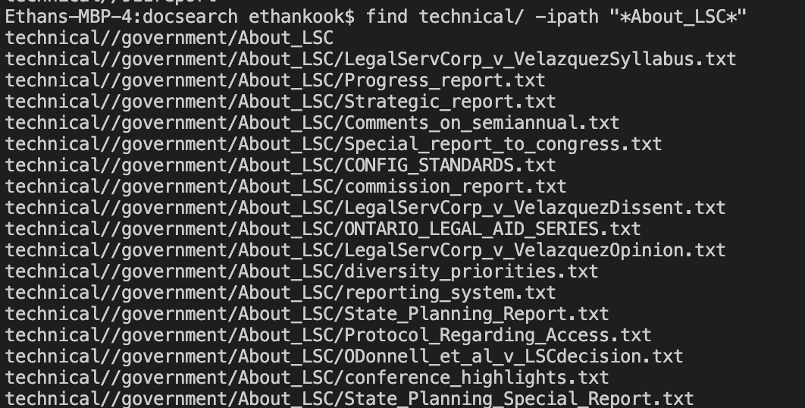
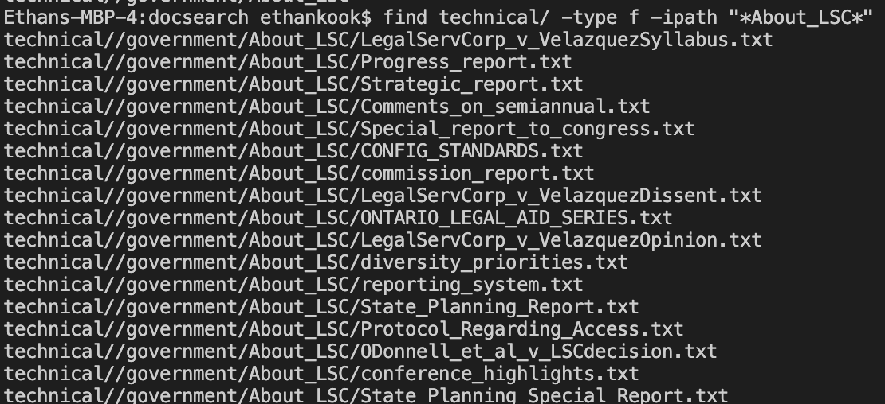

# Lab Report 3 - Bugs and Commands (Week 5)

## Part 1 - Bugs

The bug I chose was the bug in `ArrayExamples.java`, specifically in the `reversed(int arr)` method. This method is supposed to take an integer array and return a new array with the elements in reversed order.


1) A failure-inducing input for the buggy program, as a JUnit test and any associated code:
   ```
   @Test
   public void testReversedLR1(){
    int[] input1 = {1,2,3,4,5};
    assertArrayEquals(new int[]{5,4,3,2,1}, ArrayExamples.reversed(input1));
   }
   ```
   
2) An input that doesn't induce a failure, as a JUnit test and any associated code 
   ```
   @Test
   public void testReversedLR2(){
    int[] input1 = {};
    assertArrayEquals(new int[]{}, ArrayExamples.reversed(input1));
   }
   ```
   
3) The symptom, as the output of running the tests


The screenshots show the output for the two tests made in the first two parts. It shows 4 tests run because the new tests were added to the `ArrayTests.java` file, which already included 2 tests. 

4) The bug, as the before-and-after code change required to fix it


Buggy Code:

    ```
    static int[] reversed(int[] arr) {
        int[] newArray = new int[arr.length]; 
        for(int i = 0; i < arr.length; i += 1) {
          arr[i] = newArray[arr.length - i - 1];
        }
    return arr;
    }
    ```
    
Fixed Code:
   
    ```
    static int[] reversed(int[] arr) {
        int[] newArray = new int[arr.length]; //5
        for(int i = 0; i < arr.length; i += 1) {
          newArray[i] = arr[arr.length - i - 1];
        }
    return newArray;
    }
    ```
The fix addresses the code because in the buggy code, the program would change the values of     the original array rather than the new one. Because of this, it would overwrite the values, making the original values inaccessible later. The code would also replace the values of the original array with the values from the new, empty array. The fixed code changes it so that the new array, starting at index 0, is given the value of the last index in the old array. As the index of the new array increases, the index of the old array dereases, thus reversing the order of the array. The fixed code also returns the new array, rather than the original one, which was as the program intended.


## Part 2 - Researching Commands
1) 

```
find technical/ -name '*.txt'
```
Output: 


The code finds all files in the `technical` directory that ends in `.txt`. This can be useful when searching for all of the files of a certain type ( in this case, finding all text files in the directory ). The results above shown a portion of the long output. 

2) 
```
find technical/ -name pmed.0020075.txt
```
Output:


The code finds the absolute path of a file named `pmed.0020075.txt` in the `technical` directory. This can be useful if you know the name of a file but don't know the location. It will return the absolute path, showing the directories leading to the file. 

3) 
```
find technical/ -type d
```

Output:



The code finds and lists the absolute path for all files of type d (directories and subdirectories)  in the `technical` directory. This can be useful if you need to filter the results by file type when looking through a directory.

4)
```
find technical/ -type f
```

Output:



The code finds and lists the absolute path for all files of type f (all files) in the `technical` directory. The output is similar to the output in #1 because the directory mainly consists of text files. This command can be useful when trying to find a list of all files in both the main and subdirectories.

5)
```
find technical/ -maxdepth 2 -type d
```

Output:



The code finds and lists the absolute path for directories and subdirectories within a depth of 2 from the given directory ( in this case, the `technical` directory ). Because the `ls` command has many restrictions, this command can be useful when searching a directory for subdirectories within a certain depth. 


6)
```
find technical/ -maxdepth 2 -type f
```

Output:



The code finds and lists the path for all files within a depth of 2 from the given directory ( in this case, the `technical directory ). This command can be useful when searching for files in any given directory and its subdirectories within a certain depth.


7)

```
find technical/ -ipath "*About_LSC*"
```

Output:



The code finds and lists the absolute path in the given directory that contain the path given in the argument following `ipath`. This can be a useful command if you know part of the path for a directory, but do not know the location of it.


8) 
```
find technical/ -type f -ipath "*About_LSC*"
```

Output: 



The code finds and lists the absolute path for all files in the given directory and subdirectories that contain `/About_LSC` in their respective path. The `ipath` option can be used in junction with the `type` option to filter the results to only a certain type ( in this case, returns all files, and no directories ). This command can be useful when, similarly to the last command, you know part of the path for a file, and do not know the location of it. In this case, you would be searching for a file while knowing part of the path. 


Sources: 

[Link](https://www.redhat.com/sysadmin/linux-find-command)


